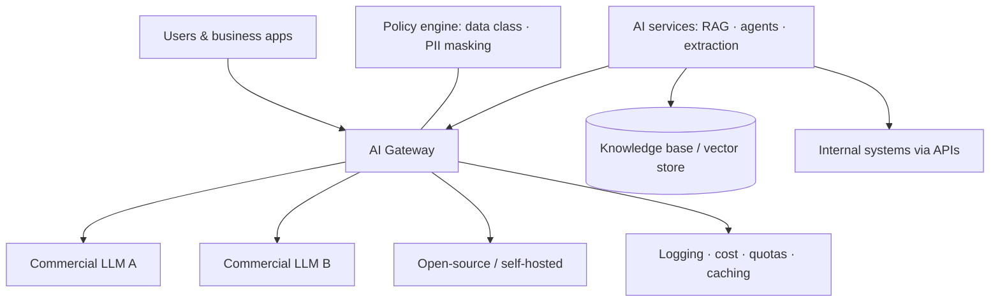

# 04 · Platform — Lab, Stack and LLM Strategy

> Goal: make technology choices **once, deliberately**, so every team doesn't reinvent them.

## 1. The AI lab

A small, safe environment to evaluate models and tools before anything reaches production.

**Minimum setup**
- Sandbox with **sanitized or synthetic data** only
- Access to 2–3 commercial models and 1–2 open-source models
- An evaluation set per use case (20–100 real examples with expected outputs)
- A simple comparison sheet: quality, latency, cost per 1,000 requests, language support

**Lab rules**
- Every experiment has a question, a dataset and a written result — even when it fails.
- Results feed the approved tool list and the platform decisions below.

## 2. Build vs. buy

| Situation | Prefer |
|---|---|
| Commodity productivity (chat, meeting notes, writing help) | **Buy** an enterprise product |
| AI feature already inside software you own (CRM, ERP, helpdesk) | **Enable** it, if it passes the checklist |
| Workflow automation across internal systems | **Low-code platform** (workflow / LLM-app builders) |
| Core business process, proprietary data, differentiation | **Build** on your own stack |
| Strict data-residency or restricted data | **Self-hosted models** or private deployments |

## 3. LLM provider strategy

- **Avoid lock-in:** call models through an abstraction layer, never directly from every app.
- **Mix models by task:** strong frontier models for reasoning and drafting; small or open-source models for classification, extraction and high volume.
- **Use a router or gateway** to switch providers without code changes.
- **Re-evaluate quarterly.** Model quality and prices change fast — your eval sets make switching cheap.

## 4. Reference architecture



**The AI gateway is the most valuable platform investment.** It gives you:
- One place for keys, quotas and budgets per team
- Cost and usage dashboards (FinOps)
- Prompt / response caching
- PII masking and data-class enforcement
- Provider failover and model switching

## 5. Platform decision record (template)

```text
Decision:      e.g. "Use a central AI gateway for all LLM calls"
Context:       why this decision is needed now
Options:       A / B / C with pros and cons
Decision:      chosen option
Consequences:  what becomes easier, what becomes harder
Review date:   when to revisit
```

Keep decisions as short ADRs (Architecture Decision Records) in a shared repo.

---
Next → [05 · Enablement](../05-enablement/training-curriculum.md)
