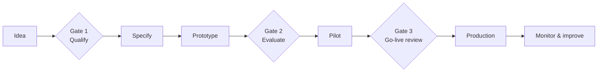

# 06 · Delivery — Use-Case Lifecycle

> Goal: move AI use cases from idea to production **predictably**, with quality gates that prevent expensive failures.

## 1. Lifecycle

## 2. Stages and gates

| Stage | Activities | Output |
|---|---|---|
| **Idea** | Captured from discovery, champions or employees | [Process card](../templates/process-card.md) |
| **Gate 1 · Qualify** | Suitability score, data class, owner, baseline | Go / no-go |
| **Specify** | Inputs, outputs, rules, edge cases, human review, success metrics | [Use-case canvas](../templates/use-case-canvas.md) |
| **Prototype** | Build in the AI lab against the eval set | Working prototype + eval results |
| **Gate 2 · Evaluate** | Does it meet the quality bar on real examples? | Go / iterate / stop |
| **Pilot** | Real users, limited scope, human-in-the-loop, measure | [Pilot report](../templates/pilot-report.md) |
| **Gate 3 · Go-live** | Security, privacy, cost, support, rollback plan | Production approval |
| **Production** | Integrated, monitored, owned | Live service |
| **Monitor** | Quality drift, cost, usage, feedback | Monthly review |

## 3. Quality bar (Gate 2)

Define **before** building:

- **Accuracy target** on the evaluation set (e.g. ≥ 90% correct fields)
- **Confidence threshold** below which items go to manual review
- **Unacceptable errors** — e.g. wrong customer, wrong amount — must be at or near zero
- **Latency and cost per transaction** within budget

## 4. Go-live checklist (Gate 3)

- [ ] Data class approved for the models used
- [ ] Secrets in a secret manager — none in code or config files
- [ ] PII masked or minimized where possible
- [ ] Prompt-injection risks reviewed (especially for agents and documents from outside)
- [ ] Human review step implemented where required
- [ ] Logging and audit trail in place
- [ ] Cost monitoring and budget alerts configured
- [ ] Fallback: what happens when the model is down or unsure
- [ ] Owner and support process defined
- [ ] Users trained; feedback channel open

## 5. Design patterns that work

- **Hybrid extraction:** deterministic rules for clear fields + AI for ambiguous ones + confidence scoring.
- **Human-in-the-loop by default:** start with AI suggesting, humans approving; automate only once metrics prove it.
- **Structured outputs:** always request JSON against a schema and validate it.
- **Citations for knowledge answers:** RAG answers must point to their sources.
- **Small, verifiable increments:** ship one document type or one email category at a time.

---
Next → [07 · Measurement](../07-measurement/kpis-and-roi.md)
