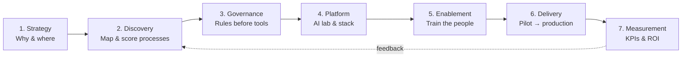

<h1 align="center">AI Adoption Playbook</h1>

  <b>A practical, field-tested playbook for bringing AI into an enterprise IT organization — from the first process map to production use cases, governance and measurable ROI.</b>

  
  
  
  

---

## Why this exists

Most organizations don't fail at AI because the models are weak. They fail because:

- They start with a tool ("we bought licenses") instead of a **process** ("this takes 40 hours a week").
- Nobody owns **governance**, so legal blocks everything — or nothing is controlled.
- Pilots never reach production because **requirements, data and integration** were an afterthought.
- Nobody can prove **ROI**, so funding dries up after the hype.

This playbook is the structured path I use as an engineering lead and AI adoption owner in a large enterprise. Everything here is **generalized and vendor-neutral** — adapt it, don't copy it.

## Who it's for

| You are… | Start with |
|---|---|
| CTO / CIO / IT director | [Adoption roadmap](01-strategy/adoption-roadmap.md) → [KPIs](07-measurement/kpis-and-roi.md) |
| AI / innovation lead | [Process discovery](02-discovery/process-mapping.md) → [Suitability scoring](02-discovery/suitability-scoring.md) |
| Architect / tech lead | [Platform decisions](04-platform/platform-decisions.md) → [Use-case delivery](06-delivery/use-case-lifecycle.md) |
| Security / legal / risk | [Governance & policy](03-governance/ai-usage-policy.md) |
| Team lead / trainer | [Enablement curriculum](05-enablement/training-curriculum.md) |

## The model at a glance

## Contents

| # | Phase | What you get |
|---|---|---|
| 01 | [Strategy](01-strategy/adoption-roadmap.md) | Maturity stages, a 12-month roadmap, roles & operating model |
| 02 | [Discovery](02-discovery/process-mapping.md) | Process-mapping method, interview guide, [suitability scoring matrix](02-discovery/suitability-scoring.md) |
| 03 | [Governance](03-governance/ai-usage-policy.md) | AI usage policy template, data classification rules, [tool evaluation checklist](03-governance/tool-evaluation-checklist.md) |
| 04 | [Platform](04-platform/platform-decisions.md) | AI lab setup, LLM provider strategy, build-vs-buy, AI gateway & cost control |
| 05 | [Enablement](05-enablement/training-curriculum.md) | Role-based curriculum for analysts, developers and business users |
| 06 | [Delivery](06-delivery/use-case-lifecycle.md) | Use-case lifecycle from idea to production, with quality gates |
| 07 | [Measurement](07-measurement/kpis-and-roi.md) | KPIs, ROI formula, executive reporting |
| — | [Templates](templates/) | Copy-paste templates: process card, use-case canvas, pilot report |

## Core principles

1. **Process first, tool second.** Never start from a product demo.
2. **Quick wins fund the journey.** Pick 2–3 low-risk, high-visibility wins in the first 90 days.
3. **Governance enables speed.** Clear rules let teams move without asking legal every time.
4. **Humans stay accountable.** AI drafts, people decide — especially for customer, financial or legal outcomes.
5. **Measure from day zero.** Baseline before the pilot, or you can't prove anything after.
6. **Build capability, not dependency.** Train your people; don't outsource your understanding.

## How to use this repo

- **Read** the phase that matches where you are today — the phases are sequential but you can enter anywhere.
- **Copy** the [templates](templates/) into your own workspace.
- **Adapt** the scoring weights, policy rules and KPIs to your industry and risk appetite.

## Contributing

Real-world lessons are the most valuable part of a playbook. Issues and PRs with practical improvements, templates or anonymized case notes are welcome.

## About the author

**Deyaa Taha** — Senior AI Engineer and engineering team lead with 20+ years building enterprise systems. I lead AI adoption inside a large enterprise and build agentic platforms, enterprise RAG and .NET / Next.js systems.

[LinkedIn](https://www.linkedin.com/in/deyaataha) · [GitHub](https://github.com/deyaa-taha)

---

Licensed under <a href="LICENSE">CC BY 4.0</a> — free to use and adapt with attribution.
