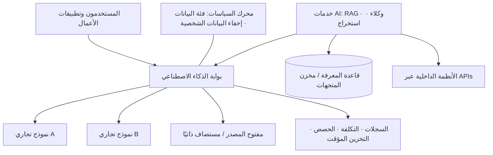

# 04 · المنصّة — المختبر والتقنيات واستراتيجية النماذج اللغوية

> الهدف: اتخاذ القرارات التقنية **مرة واحدة وبشكل مدروس**، حتى لا يعيد كل فريق اختراعها.

## 1. مختبر الذكاء الاصطناعي

بيئة صغيرة وآمنة لتقييم النماذج والأدوات قبل وصول أي شيء إلى الإنتاج.

**الحد الأدنى من الإعداد**
- بيئة معزولة تستخدم **بيانات منقّاة أو اصطناعية** فقط
- وصول إلى 2–3 نماذج تجارية و1–2 نموذج مفتوح المصدر
- مجموعة تقييم لكل حالة استخدام (20–100 مثال حقيقي مع المخرجات المتوقعة)
- جدول مقارنة بسيط: الجودة، زمن الاستجابة، التكلفة لكل 1,000 طلب، دعم اللغات

**قواعد المختبر**
- لكل تجربة سؤال ومجموعة بيانات ونتيجة مكتوبة — حتى عندما تفشل.
- النتائج تغذّي قائمة الأدوات المعتمدة وقرارات المنصّة أدناه.

## 2. البناء مقابل الشراء

| الحالة | الخيار المفضّل |
|---|---|
| إنتاجية عامة (محادثة، ملاحظات الاجتماعات، مساعدة في الكتابة) | **اشترِ** منتجًا مؤسسيًا |
| ميزة AI موجودة أصلًا في برمجيات تملكها (CRM، ERP، مكتب الدعم) | **فعّلها** إذا اجتازت قائمة التقييم |
| أتمتة سير العمل بين الأنظمة الداخلية | **منصّة منخفضة الكود** (منصّات سير العمل / بناء تطبيقات LLM) |
| عملية أعمال جوهرية، بيانات خاصة، تميّز تنافسي | **ابنِ** على منصّتك الخاصة |
| متطلبات صارمة لموقع البيانات أو بيانات مقيّدة | **نماذج مستضافة ذاتيًا** أو نشر خاص |

## 3. استراتيجية مزوّدي النماذج اللغوية (LLM)

- **تجنّب الارتهان لمزوّد واحد:** استدعِ النماذج عبر طبقة تجريد، لا مباشرة من كل تطبيق.
- **نوّع النماذج حسب المهمة:** نماذج متقدمة قوية للاستدلال والصياغة؛ ونماذج صغيرة أو مفتوحة المصدر للتصنيف والاستخراج والأحجام الكبيرة.
- **استخدم موجّهًا (Router) أو بوابة (Gateway)** للتبديل بين المزوّدين دون تغيير الشيفرة.
- **أعد التقييم كل ربع سنة.** جودة النماذج وأسعارها تتغير بسرعة — ومجموعات التقييم لديك تجعل التبديل رخيصًا.

## 4. البنية المرجعية



**بوابة الذكاء الاصطناعي هي الاستثمار الأعلى قيمة في المنصّة.** فهي تمنحك:
- مكانًا واحدًا للمفاتيح والحصص والميزانيات لكل فريق
- لوحات للتكلفة والاستخدام (FinOps)
- تخزينًا مؤقتًا للطلبات والردود
- إخفاء البيانات الشخصية (PII) وفرض قواعد فئات البيانات
- التحويل التلقائي عند تعطّل مزوّد وتبديل النماذج

## 5. سجل قرار المنصّة (قالب)

```text
القرار:        مثال: "استخدام بوابة AI مركزية لجميع استدعاءات النماذج"
السياق:        لماذا نحتاج هذا القرار الآن
الخيارات:      أ / ب / ج مع المزايا والعيوب
القرار:        الخيار المختار
العواقب:       ما الذي يصبح أسهل، وما الذي يصبح أصعب
تاريخ المراجعة: متى نعيد النظر
```

احفظ القرارات كسجلات قرارات معمارية قصيرة (ADRs) في مستودع مشترك.

---
التالي ← [05 · التمكين](../05-enablement/training-curriculum.md)
