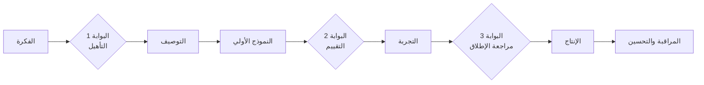

# 06 · التسليم — دورة حياة حالة الاستخدام

> الهدف: نقل حالات استخدام الذكاء الاصطناعي من الفكرة إلى الإنتاج **بشكل يمكن التنبؤ به**، مع بوابات جودة تمنع الإخفاقات المكلفة.

## 1. دورة الحياة

## 2. المراحل والبوابات

| المرحلة | الأنشطة | المخرج |
|---|---|---|
| **الفكرة** | تُجمع من الاكتشاف أو السفراء أو الموظفين | [بطاقة العملية](../templates/process-card.md) |
| **البوابة 1 · التأهيل** | درجة الملاءمة، فئة البيانات، المالك، خط الأساس | نعم / لا |
| **التوصيف** | المدخلات، المخرجات، القواعد، الحالات الحدّية، المراجعة البشرية، مقاييس النجاح | [لوحة حالة الاستخدام](../templates/use-case-canvas.md) |
| **النموذج الأولي** | البناء في مختبر AI مقابل مجموعة التقييم | نموذج أولي يعمل + نتائج التقييم |
| **البوابة 2 · التقييم** | هل يحقق معيار الجودة على أمثلة حقيقية؟ | استمر / كرّر / أوقف |
| **التجربة** | مستخدمون حقيقيون، نطاق محدود، إنسان في الحلقة، قياس | [تقرير التجربة](../templates/pilot-report.md) |
| **البوابة 3 · الإطلاق** | الأمن، الخصوصية، التكلفة، الدعم، خطة التراجع | موافقة الإنتاج |
| **الإنتاج** | متكامل، مُراقَب، له مالك | خدمة حيّة |
| **المراقبة** | انحراف الجودة، التكلفة، الاستخدام، الملاحظات | مراجعة شهرية |

## 3. معيار الجودة (البوابة 2)

حدِّد **قبل** البناء:

- **هدف الدقة** على مجموعة التقييم (مثلًا ≥ 90% من الحقول صحيحة)
- **حدّ الثقة** الذي تُحال تحته العناصر إلى المراجعة اليدوية
- **الأخطاء غير المقبولة** — مثل عميل خاطئ أو مبلغ خاطئ — يجب أن تكون صفرًا أو قريبة منه
- **زمن الاستجابة والتكلفة لكل معاملة** ضمن الميزانية

## 4. قائمة التحقق قبل الإطلاق (البوابة 3)

- [ ] فئة البيانات معتمدة للنماذج المستخدمة
- [ ] الأسرار في مدير أسرار — لا شيء منها في الشيفرة أو ملفات الإعداد
- [ ] البيانات الشخصية مخفية أو مقلّصة قدر الإمكان
- [ ] مراجعة مخاطر حقن الأوامر (خاصة للوكلاء والمستندات القادمة من الخارج)
- [ ] تنفيذ خطوة المراجعة البشرية حيث يلزم
- [ ] السجلات ومسار التدقيق قائمان
- [ ] إعداد مراقبة التكلفة وتنبيهات الميزانية
- [ ] خطة بديلة: ماذا يحدث عندما يتعطل النموذج أو لا يكون متأكدًا
- [ ] تحديد المالك وعملية الدعم
- [ ] تدريب المستخدمين؛ وقناة الملاحظات مفتوحة

## 5. أنماط تصميم أثبتت نجاحها

- **الاستخراج الهجين:** قواعد حتمية للحقول الواضحة + ذكاء اصطناعي للحقول الغامضة + تقييم الثقة.
- **الإنسان في الحلقة افتراضيًا:** ابدأ بأن يقترح الذكاء الاصطناعي ويعتمد الإنسان؛ ولا تؤتمت إلا بعد أن تثبت المقاييس ذلك.
- **المخرجات المنظَّمة:** اطلب دائمًا JSON وفق مخطط محدد وتحقق منه.
- **الاستشهادات في الإجابات المعرفية:** إجابات RAG يجب أن تشير إلى مصادرها.
- **زيادات صغيرة قابلة للتحقق:** أطلق نوع مستند واحد أو فئة بريد واحدة في كل مرة.

---
التالي ← [07 · القياس](../07-measurement/kpis-and-roi.md)
