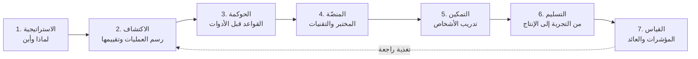

<a href="../README.md">English</a> · <b>العربية</b>

<h1 align="center">دليل تبنّي الذكاء الاصطناعي</h1>

  <b>دليل عملي مُجرَّب ميدانيًا لإدخال الذكاء الاصطناعي إلى قسم تقنية المعلومات في المؤسسات — من أول خريطة للعمليات وحتى حالات الاستخدام في بيئة الإنتاج، والحوكمة، والعائد على الاستثمار القابل للقياس.</b>

  
  
  
  

---

## لماذا هذا الدليل؟

معظم المؤسسات لا تفشل في الذكاء الاصطناعي لأن النماذج ضعيفة، بل لأنها:

- تبدأ من **أداة** ("اشترينا تراخيص") بدلًا من **عملية** ("هذه المهمة تستهلك 40 ساعة أسبوعيًا").
- لا يملك أحدٌ **الحوكمة**، فإمّا أن يوقف القسم القانوني كل شيء، أو لا يُضبط أي شيء.
- لا تصل التجارب إلى بيئة الإنتاج لأن **المتطلبات والبيانات والتكامل** جاءت كفكرة لاحقة.
- لا يستطيع أحد إثبات **العائد على الاستثمار**، فيتوقف التمويل بعد انتهاء الضجة.

هذا الدليل هو المسار المنظَّم الذي أتّبعه بصفتي قائدًا لفريق هندسي ومسؤولًا عن تبنّي الذكاء الاصطناعي في مؤسسة كبيرة. كل ما فيه **مُعمَّم ومحايد تجاه المزوّدين** — كيّفه لبيئتك ولا تنسخه حرفيًا.

## لمن هذا الدليل؟

| أنت… | ابدأ من |
|---|---|
| مدير تقنية / مدير نظم معلومات / مدير تقنية المعلومات | [خارطة طريق التبنّي](01-strategy/adoption-roadmap.md) ← [مؤشرات الأداء](07-measurement/kpis-and-roi.md) |
| مسؤول ذكاء اصطناعي / ابتكار | [اكتشاف العمليات](02-discovery/process-mapping.md) ← [تقييم الملاءمة](02-discovery/suitability-scoring.md) |
| معماري / قائد تقني | [قرارات المنصّة](04-platform/platform-decisions.md) ← [تسليم حالات الاستخدام](06-delivery/use-case-lifecycle.md) |
| أمن معلومات / قانوني / مخاطر | [الحوكمة والسياسة](03-governance/ai-usage-policy.md) |
| قائد فريق / مدرّب | [منهج التمكين](05-enablement/training-curriculum.md) |

## النموذج في لمحة

## المحتويات

| # | المرحلة | ماذا ستحصل عليه |
|---|---|---|
| 01 | [الاستراتيجية](01-strategy/adoption-roadmap.md) | مراحل النضج، خارطة طريق لـ 12 شهرًا، الأدوار ونموذج التشغيل |
| 02 | [الاكتشاف](02-discovery/process-mapping.md) | منهجية رسم العمليات، دليل المقابلات، [مصفوفة تقييم الملاءمة](02-discovery/suitability-scoring.md) |
| 03 | [الحوكمة](03-governance/ai-usage-policy.md) | قالب سياسة استخدام الذكاء الاصطناعي، قواعد تصنيف البيانات، [قائمة تقييم الأدوات](03-governance/tool-evaluation-checklist.md) |
| 04 | [المنصّة](04-platform/platform-decisions.md) | إعداد مختبر الذكاء الاصطناعي، استراتيجية مزوّدي النماذج، البناء مقابل الشراء، بوابة AI وضبط التكاليف |
| 05 | [التمكين](05-enablement/training-curriculum.md) | منهج تدريبي حسب الدور للمحللين والمطوّرين ومستخدمي الأعمال |
| 06 | [التسليم](06-delivery/use-case-lifecycle.md) | دورة حياة حالة الاستخدام من الفكرة إلى الإنتاج مع بوابات الجودة |
| 07 | [القياس](07-measurement/kpis-and-roi.md) | مؤشرات الأداء، معادلة العائد على الاستثمار، تقارير الإدارة العليا |
| — | [القوالب](templates/) | قوالب جاهزة للنسخ: بطاقة العملية، لوحة حالة الاستخدام، تقرير التجربة |

## المبادئ الأساسية

1. **العملية أولًا، والأداة ثانيًا.** لا تبدأ أبدًا من عرض توضيحي لمنتج.
2. **المكاسب السريعة تموّل الرحلة.** اختر 2–3 مكاسب منخفضة المخاطر وعالية الظهور خلال أول 90 يومًا.
3. **الحوكمة تُسرّع العمل.** القواعد الواضحة تتيح للفرق التحرك دون الرجوع إلى القسم القانوني في كل مرة.
4. **الإنسان يبقى مسؤولًا.** الذكاء الاصطناعي يقترح، والإنسان يقرّر — خصوصًا في ما يمسّ العملاء أو المال أو الجوانب القانونية.
5. **قِس من اليوم الأول.** حدّد خط الأساس قبل التجربة، وإلا فلن تستطيع إثبات أي شيء بعدها.
6. **ابنِ القدرات لا الاعتمادية.** درّب فريقك، ولا تُسند فهمك إلى جهة خارجية.

## كيف تستخدم هذا المستودع؟

- **اقرأ** المرحلة التي تناسب وضعك الحالي — المراحل متسلسلة، لكن يمكنك البدء من أي منها.
- **انسخ** [القوالب](templates/) إلى مساحة العمل الخاصة بك.
- **كيّف** أوزان التقييم وقواعد السياسة ومؤشرات الأداء بما يناسب قطاعك ومستوى تقبّلك للمخاطر.

## المساهمة

الدروس المستفادة من الواقع هي أثمن ما في أي دليل. نرحّب بالـ Issues وطلبات الدمج (PRs) التي تضيف تحسينات عملية أو قوالب أو ملاحظات حالات مجهولة الهوية.

## عن المؤلف

**ضياء طه** — مهندس ذكاء اصطناعي أول وقائد فريق هندسي بخبرة تزيد على 20 عامًا في بناء أنظمة المؤسسات. أقود تبنّي الذكاء الاصطناعي داخل مؤسسة كبيرة، وأبني منصّات الوكلاء الذكية (Agentic Platforms) وأنظمة RAG المؤسسية وأنظمة ‎.NET / Next.js.

[LinkedIn](https://www.linkedin.com/in/deyaataha) · [GitHub](https://github.com/deyaa-taha)

---

مرخّص بموجب <a href="../LICENSE">CC BY 4.0</a> — يحق لك الاستخدام والتعديل مع ذكر المصدر.
